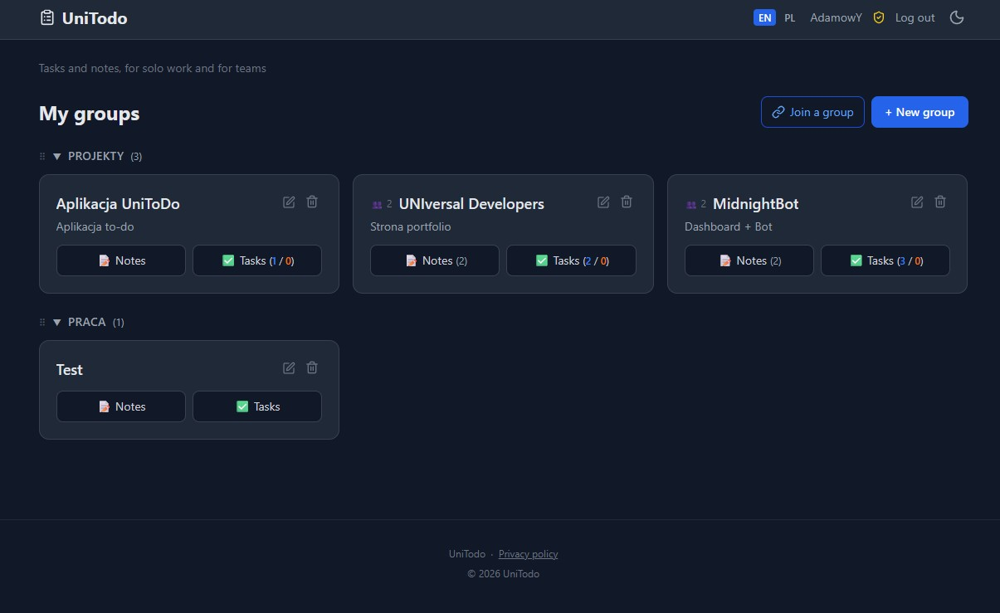
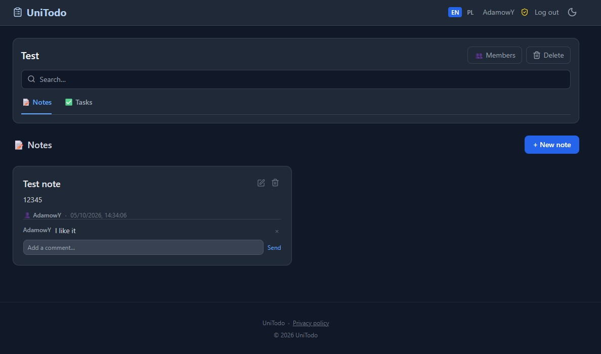
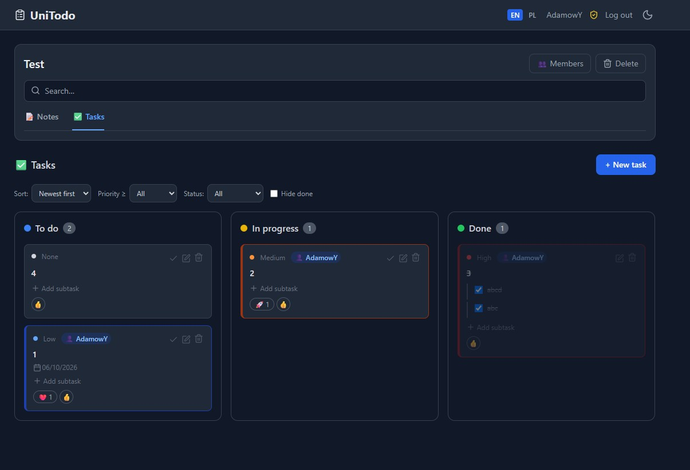

# UniTodo

A self-hosted task and note manager for a small team or for one person working alone. Work is
organised into project groups: each group holds a kanban board with tasks, subtasks, priorities and
due dates, plus notes with comments. Groups are joined through invite codes and a user only ever
sees the groups they belong to.

The interface ships in **English (default)** and **Polish**, switched from the navbar. Every string
lives in `i18n/index.js`, one table per language, so a third language is one more table there.



<sub>The dashboard groups projects by category. Every card carries its note and open task counters, and the language switcher sits in the navbar next to the dark mode toggle.</sub>

## At a glance

| | |
|---|---|
| Backend | Node.js (>= 20), Express, serverless-ready `server.js` |
| Database | PostgreSQL (Neon or any Postgres), plain SQL, no ORM |
| Views | EJS + Tailwind CSS (CDN), dark mode by default |
| Sessions | JWT in an httpOnly cookie, bcrypt password hashes |
| Languages | `en` (default), `pl` |
| Desktop | Electron wrapper for Windows (NSIS installer or portable exe) |
| Tests | `node --test`, no database required |

## What it does

- **Project groups** — group cards with categories, member counts and live task counters.
- **Tasks** — Todo / In progress / Done board, drag and drop on desktop, buttons on touch devices.
- **Subtasks** — checklists inside a task, with their own edit and delete actions.
- **Priorities and due dates** — four priority levels, overdue dates highlighted.
- **Search, sort, filter** — full-text search over titles and content, sorting by date, priority,
  title or due date, filter by status, and a "hide done" switch.
- **Notes and comments** — notes per group, comments with an author and a delete action.
- **Emoji reactions** on tasks, and live sync that notices changes made by other people.
- **Collaboration** — invite codes, member list, owner and member roles.
- **Admin panel** — user, group and item counters, recent registrations, password reset with a
  forced change on first login, account deletion.
- **Privacy policy page** — a generic template for whoever operates the instance.

## Screenshots

| Notes and comments | Tasks and subtasks |
|---|---|
|  |  |
| Notes carry their author, a timestamp and a comment thread with a delete action per comment. | Tasks move between Todo, In progress and Done; each card shows priority, due date, assignee, subtask checklist and reactions. |

## Requirements

- Node.js 20 or newer
- A PostgreSQL database (a free Neon project is enough)

## Run it locally

```bash
npm install
cp .env.example .env      # or create .env by hand, see the variables below
npm run migrate           # creates the tables
npm run server            # http://localhost:3000
```

`npm run dev` runs through `vercel dev` instead, which is useful when you want the deployment
routing to match production.

### Environment variables

| Variable | Required | Purpose |
|---|---|---|
| `DATABASE_URL_UNPOOLED` | yes | PostgreSQL connection string used by the app and the migrations |
| `DATABASE_URL` | fallback | used when `DATABASE_URL_UNPOOLED` is not set |
| `JWT_SECRET` | in production | signs the session tokens; the app refuses to start without it when `NODE_ENV=production` or on Vercel. Locally a well-known development secret is used |
| `ADMIN_USER_IDS` | no | comma-separated user ids that get the admin panel |
| `PORT` | no | local port, 3000 by default |
| `UNITODO_URL` | desktop only | address the desktop wrapper opens |

### Migrations

`npm run migrate` is idempotent, it creates the schema when it is missing. `db/migrate-v2.js` up to
`db/migrate-v7.js` are the incremental steps that were applied to the live database during
development and are kept for the record; a fresh install only needs `db/migrate.js`.

## Deploy

The app is built for Vercel with a Neon PostgreSQL database, and `vercel.json` routes every request
to `server.js`. Set the environment variables from the table above in the project settings, run the
migration against the production database once, and every commit on `main` becomes a deployment.

## Desktop wrapper

The Electron wrapper only opens a UniTodo deployment that already runs somewhere, so it needs to
know the address:

```bash
export UNITODO_URL=https://your-instance.example     # or create unitodo.config.json
npm start                                           # opens the window
npm run build                                       # NSIS installer into dist/
npm run build:portable                              # single portable exe instead
```

`unitodo.config.json` sits next to `package.json` and holds `{ "url": "https://your-instance.example" }`.
Without the variable or the file the app shows a message and quits instead of opening a blank window.
The wrapper opens external links in the system browser.

## Tests

```bash
npm test
```

The suite runs on `node --test` and needs no database: it checks the translation tables for
completeness, the form validation rules, the JWT helpers, and renders every view in both languages
to catch a template that would break at runtime. CI runs the same command on every push
(`.github/workflows/tests.yml`).

## Adding a language

1. Add the code to `LANGUAGES` in `i18n/index.js` and a locale to `LOCALES` for date formatting.
2. Copy the `en` table, translate the values, keep the keys. A missing key falls back to English.
3. The navbar builds the switcher from `LANGUAGES`, so nothing else is needed.

## Project layout

```
auth/          login, registration, password change, JWT middleware
db/            PostgreSQL pool and migrations
docs/          the screenshots used above
i18n/          every user-visible string, one table per language
lib/           shared validation rules
public/        front-end JavaScript, icons
routes/        dashboard, groups, notes, tasks, admin panel
views/         EJS templates (layout.ejs is the shell)
tests/         node --test suite
server.js      Express app, also the Vercel entry point
electron-main.js  desktop wrapper
```

## Licence

MIT, see `LICENSE`.

## Polski

UniTodo to samodzielnie hostowany menedżer zadań i notatek: grupy projektów, tablica kanban z
podzadaniami, priorytetami i terminami oraz notatki z komentarzami. Grupy dołącza się przez kod
zaproszenia, a każdy użytkownik widzi wyłącznie swoje grupy.

Interfejs jest dostępny w języku **angielskim (domyślnym)** i **polskim** — język przełącza się w
nawigacji, a wszystkie teksty leżą w `i18n/index.js`. Instalacja: `npm install`, `npm run migrate`,
`npm run server`. Wersja desktopowa (Electron, Windows) wymaga adresu wdrożenia w zmiennej
`UNITODO_URL` albo w pliku `unitodo.config.json`. Testy: `npm test`. Licencja: MIT.
